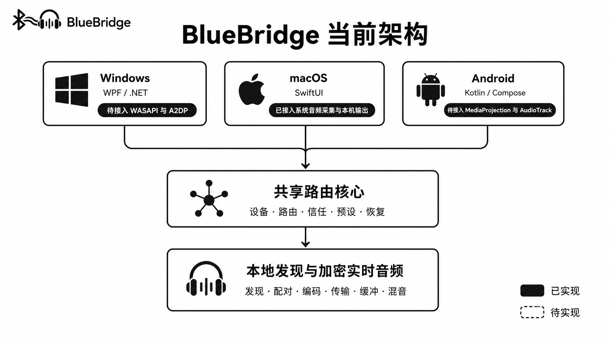
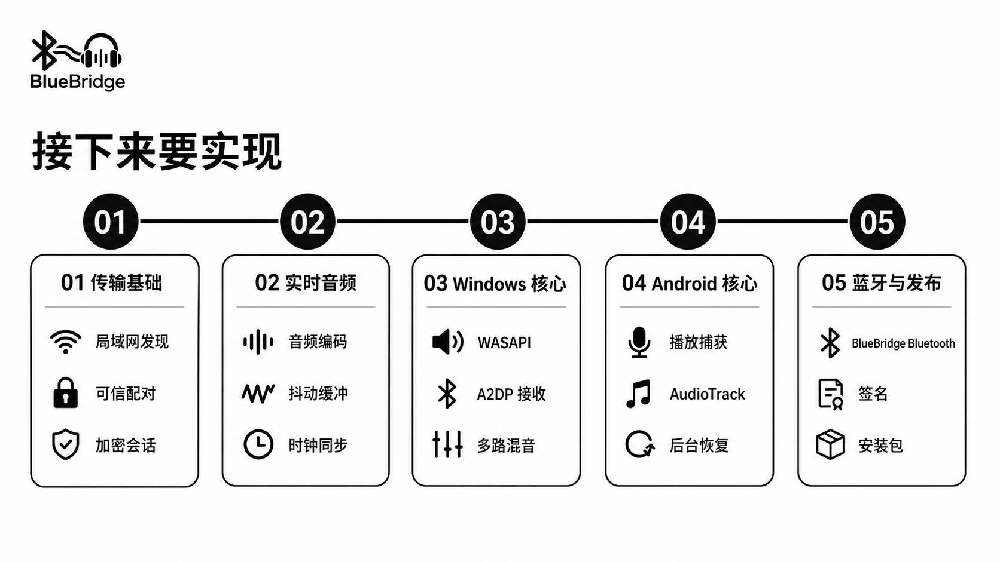

<p align="center">
  
</p>

<h1 align="center">BlueBridge</h1>

<p align="center"><strong>一个耳机，听见所有设备。</strong></p>

<p align="center">
  面向 Windows、macOS 和 Android 的本地优先个人音频路由器。
</p>

> 当前阶段：项目正在迁移为一个 Flutter 跨平台应用。统一 UI 已完成重置；原生 macOS 音频版本继续保留，直到真实音频能力迁移完成。

## BlueBridge 是什么

BlueBridge 希望让用户只佩戴一副耳机，就能接收和管理来自电脑、手机及其他设备的音频。Windows、macOS、Android 共用 Flutter / Dart 前台；系统音频由各平台原生插件实现；设备、路由、信任关系和恢复策略继续由 Rust 核心统一描述。

- 本地优先：设备发现、配对和音频传输优先在局域网或蓝牙内完成。
- 隐私优先：不依赖云端转发，后续传输层默认使用端到端加密。
- 信息优先：三端界面统一使用中文、低色彩和清晰的信息层级。
- 不模拟状态：未接入的系统能力会明确标记，不把演示数据当作真实设备或连接。

## 跨平台重构状态

| 模块 | 当前可用能力 | 接下来要接入 |
|---|---|---|
| **统一 Flutter 应用** | Windows、macOS、Android 工程；中文响应式 UI；真实空状态；统一 Logo；组件测试 | 平台网关、真实数据流、应用生命周期 |
| **macOS 音频** | 旧原生版本已有 CoreAudio、ScreenCaptureKit、AVAudioEngine 真实实现 | 迁移到 Flutter macOS 插件 |
| **Windows 音频** | 保留 WPF 工程和接口作为迁移参考 | Flutter Windows 插件、WASAPI、标准 A2DP 接收 |
| **Android 音频** | 保留 Compose 工程和接口作为迁移参考 | Flutter Android 插件、MediaProjection、AudioTrack |
| **共享核心** | Rust 路由校验、环路阻止、链路选择、重连退避和单元测试 | 通过 C ABI / Dart FFI 接入 Flutter |

旧原生工程和网页原型只作为迁移参考；达到功能等价前不会删除已有的真实 macOS 音频实现。

## 统一 UI 重置


新版界面只保留概览、路由、设备、设置四个信息入口。平台插件未接入时显示“尚未接入、0、未启动”等真实空状态，不再生成设备名称、在线状态或延迟数据。

## 目标架构

```text
Flutter / Dart 统一 UI 与业务编排
            │
      类型化平台网关
     ┌──────┼──────┐
 Windows   macOS  Android     平台音频插件
 WASAPI  CoreAudio MediaProjection
     └──────┼──────┘
            │
       Rust 共享核心          路由、信任、恢复、传输
```

Flutter 官方支持 Windows 和 macOS 桌面应用，也支持通过平台通道调用平台代码；Rust 核心通过稳定的 C ABI 和 Dart FFI 接入。详细迁移步骤见 [跨平台迁移计划](docs/MIGRATION_PLAN.md)。

### 迁移前架构参考



这张图记录原生三端方案，保留用于核对迁移范围：

目标数据流：

```text
系统或应用音频
  → 原生采集
  → 重采样与编码
  → 加密本地传输
  → 抖动缓冲与解码
  → 多路混音
  → 用户选择的耳机或扬声器
```

更完整的分层说明见 [架构文档](docs/ARCHITECTURE.md)。

## 接下来要实现



按迁移风险和可交付价值排序：

1. **平台网关**：定义 Flutter UI、平台音频插件和 Rust 核心之间的类型化契约。
2. **迁移 macOS**：先把已经验证的 CoreAudio / ScreenCaptureKit 能力接入新 UI。
3. **接入 Rust 核心**：稳定 C ABI、Dart FFI、路由校验与恢复状态同步。
4. **Windows 与 Android**：分别实现 WASAPI / A2DP 和 MediaProjection / AudioTrack 插件。
5. **跨设备传输与发布**：发现、可信配对、加密实时音频、签名、安装包和更新。

准确的实现边界见 [实现状态](docs/IMPLEMENTATION_STATUS.md)。

## 下载当前版本

- [BlueBridge for macOS v0.2.0](releases/BlueBridge-macOS-v0.2.0.zip) — Apple 芯片，macOS 14+

此版本不包含模拟设备或模拟连接状态。它会读取真实 CoreAudio 输出设备，并通过 ScreenCaptureKit 与 AVAudioEngine 路由真实的 macOS 系统音频；局域网和蓝牙跨设备路由尚未启用。

## 仓库结构

```text
apps/
  bluebridge/       新的统一 Flutter 应用（主开发入口）
  windows/          旧 Windows 原生工程（迁移参考）
  macos/            旧 macOS 原生工程（保留真实音频实现）
  android/          旧 Android 原生工程（迁移参考）
shared/
  bluebridge-core/  共享路由、设备、信任、预设与恢复模型（Rust）
branding/           项目 Logo 与品牌源文件
docs/               架构、状态与 README 信息图
releases/           可下载版本
web-prototype/      仅供参考的旧网页原型
```

## 本地验证

统一 Flutter 应用：

```bash
cd apps/bluebridge
flutter analyze
flutter test
flutter run -d macos
```

共享 Rust 核心：

```bash
cargo test --workspace
```

旧 macOS 音频版本：

```bash
swift build --package-path apps/macos
./apps/macos/scripts/package.sh
```

Android 需要 JDK 17 与 Android SDK；Windows 桌面版本必须在 Windows + Visual Studio 环境编译。各端系统音频插件仍必须在对应操作系统上完成和验证。

## 品牌资源

项目主 Logo 使用 [`branding/bluebridge-logo.png`](branding/bluebridge-logo.png)。新的 Flutter 应用已经统一预置 Android、macOS 和 Windows 图标；旧工程的图标仍保留用于迁移期间的构建。

- Flutter 应用资源：`apps/bluebridge/assets/images/bluebridge-logo.png`
- macOS AppIcon：`apps/bluebridge/macos/Runner/Assets.xcassets/AppIcon.appiconset/`
- Windows 图标：`apps/bluebridge/windows/runner/resources/app_icon.ico`
- Android 图标：`apps/bluebridge/android/app/src/main/res/mipmap-*/ic_launcher.png`

三端均从同一张 Logo 源图派生，后续替换源图时应同步生成平台图标。
