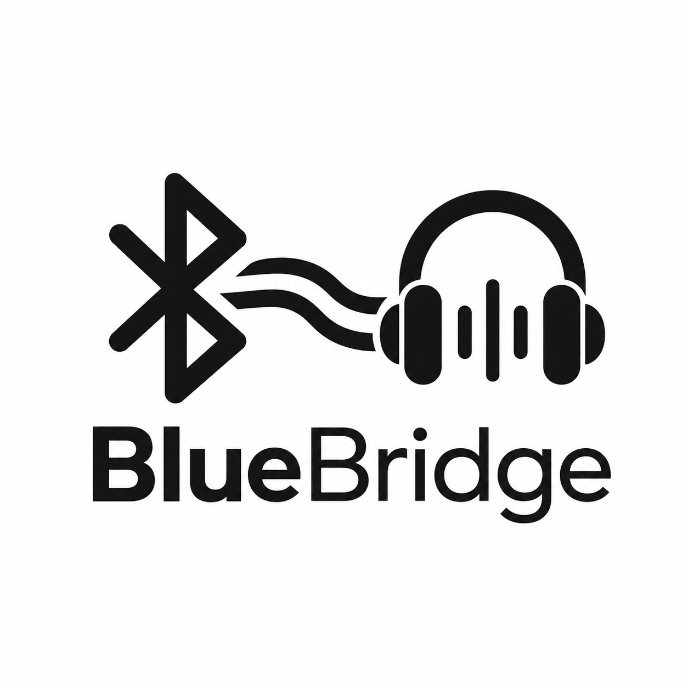
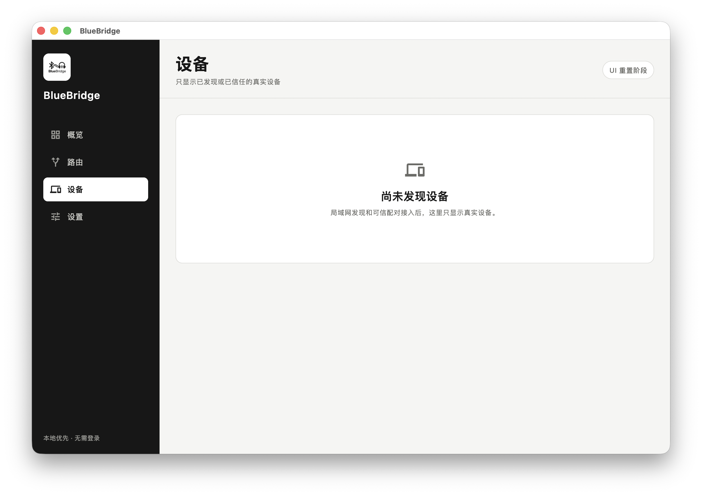

<p align="center">
  
</p>

<h1 align="center">BlueBridge</h1>

<p align="center"><strong>一个耳机，听见所有设备。</strong></p>

<p align="center">面向 Windows、macOS 和 Android 的本地优先个人音频路由器。</p>

> 当前版本：`0.3.0` 跨平台基础版。Flutter UI、三端工程和 Rust 共享核心已经就位；真实系统音频、设备发现和跨设备传输尚未实现。

## 项目定位

BlueBridge 计划让用户只佩戴一副耳机，就能接收和管理来自电脑、手机及其他设备的音频。

- **一个前台**：Windows、macOS、Android 共用 Flutter / Dart。
- **原生音频**：WASAPI、CoreAudio、ScreenCaptureKit、MediaProjection 等能力由平台插件实现。
- **共享核心**：设备、信任、路由校验、环路保护和恢复策略由 Rust 维护。
- **本地优先**：不要求 GPT 或其他云账户登录，音频不会依赖云端转发。
- **不模拟状态**：功能尚未接入时显示真实空状态，不生成设备、连接或延迟数据。

## 当前进度

| 模块 | 状态 | 已完成 |
|---|---|---|
| Flutter 跨平台工程 | **已完成基础搭建** | Android、macOS、Windows 工程和统一应用入口 |
| 中文响应式 UI | **已完成第一版** | 桌面侧栏、移动底栏、概览、路由、设备、设置、真实空状态 |
| 品牌资源 | **已完成** | 三端 Logo、应用图标、README 视觉资源 |
| UI 测试 | **已通过** | 静态检查和 2 项组件测试 |
| Rust 共享核心 | **已完成基础模型** | 路由校验、环路阻止、链路选择、重连退避和 4 项测试 |
| Flutter 平台网关 | **未开始** | 下一阶段定义音频、设备、权限和错误状态接口 |
| macOS 系统音频 | **未实现** | 计划接入 CoreAudio、ScreenCaptureKit 和 AVAudioEngine |
| Windows 系统音频 | **未实现** | 计划接入 WASAPI 和标准 A2DP 接收 |
| Android 系统音频 | **未实现** | 计划接入 MediaProjection、AudioPlaybackCapture 和 AudioTrack |
| 跨设备传输 | **未实现** | 局域网发现、可信配对、加密实时音频和抖动缓冲 |

当前应用可以用于确认 UI、导航和跨平台工程，但还不能完成真实音频路由。

## 当前 UI



界面只保留四个主要入口：概览、路由、设备和设置。平台能力接入前会明确显示“尚未接入”“未启动”或空列表。

## 目标架构

```text
Flutter / Dart
统一 UI · 状态展示 · 业务编排
        │
        ▼
类型化平台网关
        │
  ┌─────┼─────┐
  ▼     ▼     ▼
Windows macOS Android
WASAPI  CoreAudio  MediaProjection
  └─────┼─────┘
        ▼
Rust 共享核心
路由 · 信任 · 恢复 · 传输
```

实时 PCM 不通过普通 UI 消息通道传输。Flutter 负责低频控制与状态，音频数据面使用平台原生缓冲区和 FFI。详见 [架构文档](docs/ARCHITECTURE.md)。

## 下一步

1. 定义 Flutter 平台网关和真实状态模型。
2. 首先实现 macOS 输出设备枚举与系统音频采集。
3. 为 Rust 核心提供稳定 C ABI，并接入 Dart FFI。
4. 实现 Windows WASAPI / A2DP 和 Android 播放捕获。
5. 实现发现、可信配对、加密实时音频和多路混音。
6. 完成三端签名、安装包、诊断与更新。

详细任务见 [开发路线图](docs/ROADMAP.md)，准确能力边界见 [实现状态](docs/IMPLEMENTATION_STATUS.md)。

## 仓库结构

```text
apps/
  bluebridge/       Flutter 跨平台应用（唯一主应用）
shared/
  bluebridge-core/  Rust 共享领域核心
branding/           Logo 与品牌源文件
docs/               架构、路线图、状态和 UI 截图
releases/           正式发布说明
```

旧原生前台和网页原型已经从当前代码树移除，但仍保留在 Git 历史中。

## 本地运行

Flutter 应用：

```bash
cd apps/bluebridge
flutter pub get
flutter analyze
flutter test
flutter run -d macos
```

Rust 核心：

```bash
cargo test --workspace
```

构建要求：

- macOS：Flutter、Xcode；接入原生插件后需要 CocoaPods。
- Android：Flutter、JDK 17、Android SDK。
- Windows：Flutter、Windows、Visual Studio 的 Desktop development with C++ 工作负载。

## 开发原则

1. 所有用户界面使用简体中文。
2. 以黑、白、灰为主，仅在必要状态中使用颜色。
3. 不展示模拟设备、模拟连接或模拟延迟。
4. 每次只增加可验证的小功能，保持三端共用一个前台。
5. 平台音频必须在对应操作系统和真实设备上验收。
